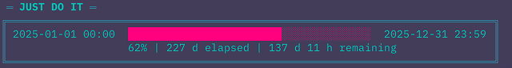

# doit - Just Do It!

[](https://www.rust-lang.org)
[](https://opensource.org/licenses/MIT)


**doit** is a CLI tool to visualize your time and boost your focus.
Set a duration or deadline, and see your progress in real time.
Use this tool to maximize your concentration and motivation!

```
$ doit -f "2025-08-12 08:00:00" -d 9h -g "Just Do It!"

Just Do It!
08:00 → 17:00   |   92%   |   8h 14m / 9h

█████████████████████████████████████████████████████████████████░░░░░░

46 m remaining
```
---

## Features

- ⏱️ **Time-based progress bar** with real-time updates (60-second intervals)
- 🎯 **Flexible time formats** (`2h`, `2025-08-10 09:00:00`, etc.)
- 🎨 **Smart dynamic formatting** - automatically adjusts time display based on duration
- 🔄 **Real-time updates** with optimized 60-second refresh
- 📝 **Custom goal support** for motivational progress sessions
- 🎭 **Multiple styles** (default, retro, synthwave)
- 🖥️ **Cross-platform** (Linux/macOS/Windows)
- ⚡ **Colored output** with intelligent time calculations

## Dynamic Time Display

**doit** automatically chooses the best time format based on your session duration:

- **≤24h**: `14:30` (clean time format)
- **≤7d**: `8/16 14:30` (includes date)
- **>7d**: `2025-08-16 14:30` (full datetime)

Total duration is also smartly formatted:
- **≤1h**: `1h 23m 45s` (precise to seconds)
- **≤24h**: `12h 34m` (hours and minutes)
- **≤7d**: `3d 14h` (days and hours)
- **>7d**: `2w 4d` (weeks and days)

## Install

### Via Homebrew (Recommended)

```bash
# Add the tap
brew tap matsuokashuhei/doit

# Install doit
brew install doit
```

### Manual Installation

```bash
git clone https://github.com/matsuokashuhei/doit.git
cd doit
cargo build --release
sudo cp target/release/doit /usr/local/bin/
```

### Pre-built Binaries

Download the latest release from [GitHub Releases](https://github.com/matsuokashuhei/doit/releases)

## Usage

```bash
# Basic usage with duration
doit --duration "3h"

# Set custom start and end times
doit --from "2025-08-10 09:00:00" --to "2025-08-10 17:00:00"

# Add a custom goal to your progress session
doit --from "2025-08-10 09:00:00" --duration "8h" --goal "Deep Work Session"

# Use retro style for military-style motivation
doit --from "2025-08-10 09:00:00" --duration "8h" --goal "JUST DO IT!" --style retro

# Use synthwave style for synthwave-style aesthetic
doit --from "2025-08-10 09:00:00" --duration "8h" --goal "CYBER FOCUS" --style synthwave

# Short form options
doit -f "2025-08-10 09:00:00" -d "8h" -g "My Task"
```

### Options

- `--from` / `-f` Start time (optional, default: current time)
- `--to` / `-t` End time (mutually exclusive with --duration)
- `--duration` / `-d` Duration (e.g. `25m`, `2h`) (mutually exclusive with --to)
- `--goal` / `-g` Goal message for motivation
- `--style` / `-s` Display style [default|retro|synthwave]

## Example Output

### Default Theme (With Custom Title)

```
Just Do It!
08:00 → 17:00   |   92%   |   8h 14m / 9h

█████████████████████████████████████████████████████████████████░░░░░░

46 m remaining
```

### Default Theme (Without Title)

```
08:00 → 17:00   |   92%   |   8h 14m / 9h

█████████████████████████████████████████████████████████████████░░░░░░

46 m remaining
```

### Retro Theme Example

```
[JUST DO IT!] FOCUS SESSION INITIATED
============================================================
[START]     2025-08-16 08:00:00
[END]       2025-08-16 17:00:00
[ELAPSED]   92% | 8h 14m
[REMAINING] 46 m

[PROGRESS]
[███████████████████████████████████████████████████░░░░░░░]
============================================================
STATUS: > ALMOST THERE, SOLDIER! HOLD YOUR POSITION.
============================================================
(Q) QUIT | (CTRL+C) ABORT
```

### Synthwave Theme Example



```
═ JUST DO IT ═
╔════════════════════════════════════════════════════════════════════════════╗
║ 2025-01-01 00:00  ████████████████████████░░░░░░░░░░░░░░  2025-12-31 23:59 ║
║                   62% | 227d elapsed | 137d remaining                     ║
╚════════════════════════════════════════════════════════════════════════════╝
                       ⚡ KEEP THE ENERGY FLOWING ⚡
```

## Time Examples

**doit** smartly formats time displays based on session length:

### Short Sessions (≤24 hours)
```bash
$ doit -f "14:00:00" -d "2h" -g "Focus Session"

Focus Session
14:00 → 16:00   |   25%   |   30m / 2h

██████████░░░░░░░░░░░░░░░░░░░░░░░░░░░░░░░░░░░░░░░░░░░░

1h 30m remaining
```

### Medium Sessions (≤7 days)
```bash
$ doit -s "2025-08-16 09:00:00" -d "3d" -t "Sprint Week"

Sprint Week
8/16 09:00 → 8/19 09:00   |   33%   |   1d 2h / 3d

█████████████░░░░░░░░░░░░░░░░░░░░░░░░░░░░░░░░░░░░░░░░░░░░░░░░

1d 22h remaining
```

### Long Sessions (>7 days)
```bash
$ doit -s "2025-08-01 00:00:00" -e "2025-12-31 23:59:59" -t "Annual Goal"

Annual Goal
2025-08-01 00:00 → 2025-12-31 23:59   |   12%   |   15d / 152d

████░░░░░░░░░░░░░░░░░░░░░░░░░░░░░░░░░░░░░░░░░░░░░░░░░░░░░░░░░░░░░

137d remaining
```

## Development & Testing

```bash
cargo test        # Run all tests (36 comprehensive test cases)
cargo clippy      # Lint checking
cargo fmt         # Code formatting
cargo build --release  # Optimized build
```

## Recent Updates (v0.8.0)

### 🔄 Major CLI Refactoring (Breaking Changes)
- **Renamed Arguments**: `--start` → `--from` (-f), `--end` → `--to` (-t), `--title` → `--goal` (-g), `--theme` → `--style` (-s)
- **Removed Arguments**: `--interval`, `--verbose` (fixed to 60-second updates for optimal performance)
- **Enhanced Motivation**: Goal-focused messaging instead of generic titles
- **Simplified Interface**: Cleaner, more intuitive argument structure

### 🧪 Testing
- Updated comprehensive test suite (35 test cases)
- All functionality validated with new argument structure
- Maintained backward compatibility for time parsing

### 📋 Migration Guide
- `doit --start "time" --end "time"` → `doit --from "time" --to "time"`
- `doit --title "message"` → `doit --goal "message"`  
- `doit --theme retro` → `doit --style retro`
- Remove `--interval` and `--verbose` flags (automatic 60s updates)

## License

MIT

---

**Maximize your focus and motivation with this tool!**
